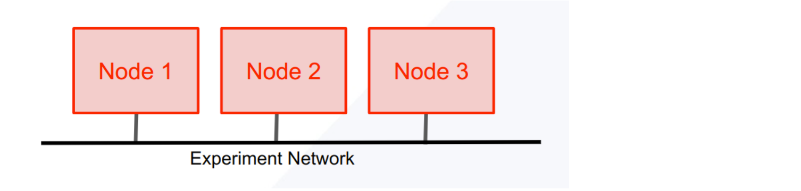
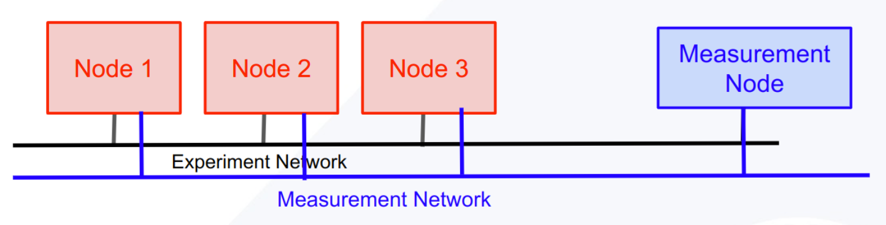
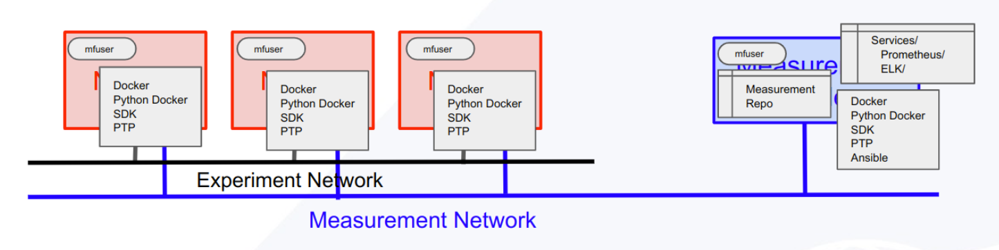
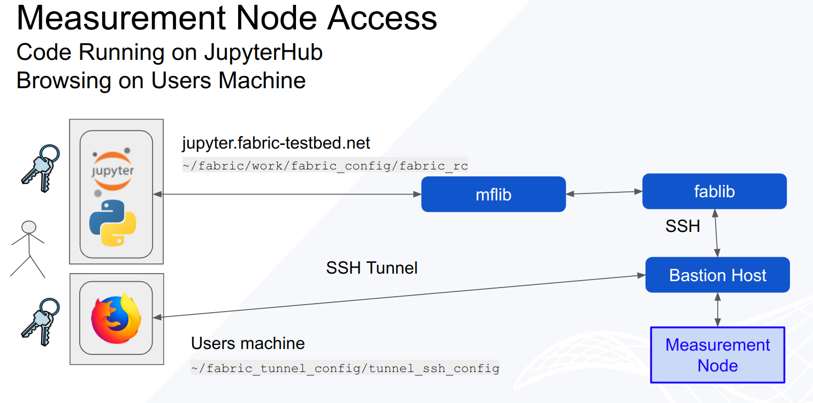

# MFLib Overview
MFLib consists of several classes.

Core – Core makes up the base class that defines methods needed to interact with the nodes in a slice, most notably with the special Measurement Node. This class is used by higer-level classes so the average user will not need to use this class directly.
MFLib – MFLib is the main class that a user will use to instrumentize a slice and interact with the monitoring systems.
MFVis – MFVis makes it easy to show and download Grafana graphs directly from python code. MFVis requires that the slice has been previously instumentized by MFLib


## MFLib Methods
MFLib is a python library that enables automatic monitoring of a FABRIC experiment using Prometheus, Grafana and ELK. It can be installed using pip install fabrictestbed-mflib . You can also install the latest code by cloning the fabrictestbed/mflib source code and following the install instructions. Here are the most common methods you will need for interacting with MFLib. For more details see the class documentation.

### Creating a Slice
Slice creation is done as you would normally create a slice, but requires an extra step before you submit the slice.

**MFLib().addMeasNode(slice)** where slice is a fabric slice that has been specified but not yet submitted. This example has 3 ndoes and an experimental network.



The **MFLib().addMeasNode(slice)** adds an extra node called the Measurement Node (meas_node) and an measurement network.



### Init & Instrumentize
MFlib works on an existing slice to which MFLib must first add some software and services.

**MFLib(slice_name)**  `mf = MFLib(slice_name, local_storage_directory="/tmp/mflib")` First you must create the MFLib object by passing the slice name to MFLib() . You can optionally pass a string for where you would like the local working files for the slice to be stored. These files include keys, Ansible hosts file, progress and log files and any downloaded files. The default location is in the tmp directory. If you plan on revisiting the slice or the log files later, you should change the directory to a persistent directory of your choosing.  
This is called initializing the slice. This process:
* Add mfuser to all the nodes
* Clones MeasurementFramework repository to mfuser account on the Measurement Node
* Creates ansible.ini file for the slice and uploads it to the Measurement Node
* Runs a BASH script on the Measurement Node
* Runs an Ansible script on the Measurement Node
* Sets up Measurement Services that can later be installed
* Ensures Docker & PTP services are running on the experiment's nodes



**MFLib.instrumentize()**  `mf.instrumentize()` MFLib needs to be “instrumentized” to start the monitoring collection. This process will add the systems needed to collect Prometheus metrics and Elastic logs along with Grafana and Kibana for visualizing the collect data. If you only need one of these, or if you want to add other services, include a list of strings naming the services you would like to install. mv.instrumentize( ["prometheus"])
This is called the instrumentizing the slice. This process:
* By default, installs and starts monitoring with: 
  * Prometheus & Grafana
  * ELK with Kibana


### Service Methods
Measurement Framework has “services” which are installed on the measurement node. The MFLib.instrumentize() method installs Prometheus, Grafana, and ELK..
MFLib is built on top of MFLib.Core(). MFLib uses Core methods to interact with services using several basic methods: create, info, update, start, stop and remove.
Each of these methods require the service name. Most can also take an optional dictionary and an optional list of files to be uploaded. All will return a json object with at least a “success” and “msg” values.

**MFLib.create**  `mf.create(service, data=None, files=[])` is used to add a service to the slice. By default, Prometheus, ELK, Grafana and Overview services are added during instrumentation.

**MFLib.info**  `mf.info(service, data=None)` is used to get information about the service. This will be the most commonly used method. For example Prometheus adds Grafana to the experiment to easily access and visualize the data collected by Prometheus. In order to access Grafana as an admin user, you will need a password. The password can be retrieved using

```
data = {}
data["get"] = ["grafana_admin_password"]
info_results = mf.info("prometheus", data)
print(info_results["grafana_admin_password"])
Info calls should not alter the service in anyway.
```

**MFLib.update**  `mf.info(service, data=None, files=[])` is used to update the service configurations or make other changes to the service’s behavior. For example you can add custom dashboards to Grafana using the grafana_manager.
```
data = {"dashboard":"add"}
files = ["path_to_dashboard_config.json"]
mf.update("grafana_manager", data, files)
```
**MFLib.stop**  `mf.stop(service)` is used to stop a service from using resources. The service is not removed and can be restarted.

**MFLib.start**  `mf.start(service)` is used to restart a stopped service.

**mflib.remove**  `mf.remove(service)` is used to remove a service. This will stop and remove any artifacts that were installed on the experiment’s nodes.

**mflib.download_common_hosts**  `mf.download_common_hosts()` retrieves an ansible hosts.ini file for the slice. The hosts file will contain 2 groups: Experiment_nodes and Measurement_node

**mflib.download_log_file**  `mf.download_log_file(service, method)` retrieves the log files for runs of the given service’s method: create, info, update…etc. This can be useful for debugging.


### Accessing Experiment Nodes via Bastion Host

Many of the services set up by MFLib run web accessible user interfaces on the Measurement Node. Since experimental resources are secured by the FABRIC Bastion host, a tunnel must be created to access the web pages. 

MFLib has properties, **MFLIB.grafana_tunnel** & **MFLib.kibana_tunnel** that will return the needed commands to create tunnels to access the relative service. 

